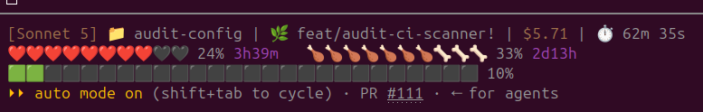

# ⛏️ minecraft-statusline

[](https://www.npmjs.com/package/minecraft-statusline)
[](https://www.npmjs.com/package/minecraft-statusline)
[](./LICENSE)

A Minecraft-themed statusline for [Claude Code](https://claude.com/claude-code). Your rate limits
become hearts and food, your context window becomes an XP bar, and the model name is tinted like
crafting materials.



## Legend

| Element | Meaning |
| --- | --- |
| `[Model]` tint | Netherite (Fable), diamond (Opus), gold (Sonnet), iron (Haiku) |
| 📁 `dir` | Current working directory |
| 🌿 `branch` | Git branch, with `*` (uncommitted changes) or `!` (untracked files) |
| `$cost` | Total session cost |
| ⏱️ | Elapsed session time |
| ↩ / ↪ | Cache read / cache write tokens |
| ❤️ / 🖤 | 5-hour rate limit — hearts deplete as usage climbs |
| 🍗 / 🦴 | 7-day rate limit — food depletes as usage climbs |
| 🟩 / ⬛ | Context window usage — XP bar fills as it climbs |

## Install

```
npx minecraft-statusline
```

This backs up any existing `~/.claude/settings.json` and statusline script, installs
`~/.claude/minecraft-statusline.js`, and points Claude Code's `statusLine` setting at it.

## Requirements

- [Claude Code](https://claude.com/claude-code)
- [Node.js](https://nodejs.org) — you already have it if you can run `npx`; the statusline itself
  runs on Node, so there's nothing else to install
- `git` (optional — only used to show the current branch)

Works on Windows, macOS, and Linux with no extra dependencies (no `jq` or `bash` needed).

## Uninstall

```
npx minecraft-statusline --uninstall
```

Restores your previous `settings.json` and removes the installed script.

## Customize

The installed script lives at `~/.claude/minecraft-statusline.js` — edit it directly to change
colors, icons, or segments.
